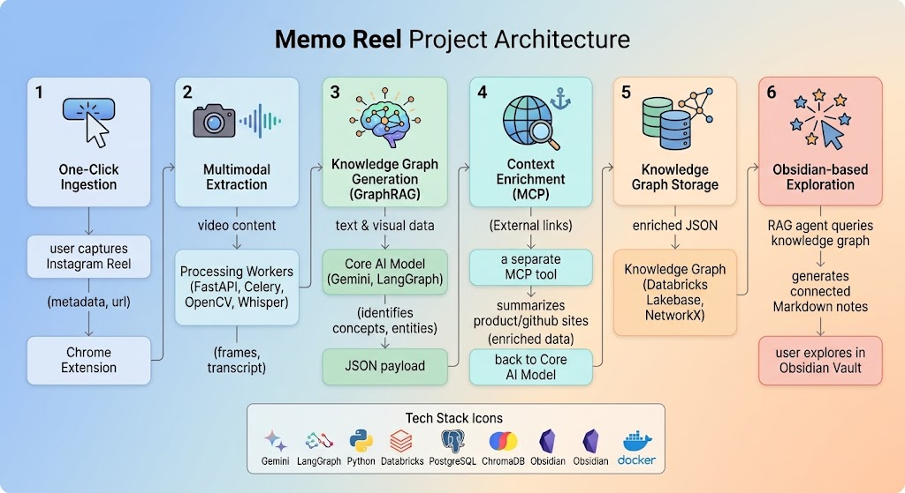
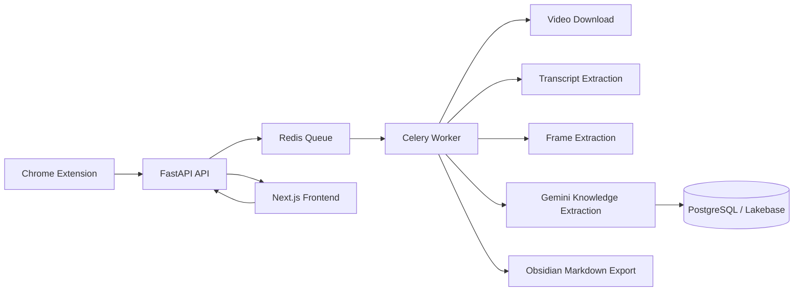

# Memo Reel

Memo Reel is a browser extension and AI pipeline for saving useful ideas from
Instagram Reels. It extracts what is spoken and shown, then turns each Reel
into structured, searchable knowledge that can be explored through a graph,
chat, or Obsidian.

[](https://devpost.com/software/recallgraph-gyhz7u#submission-history)

## Project Media

### Architecture



### Presentation and Demo

[Watch the Memo Reel presentation and demo](assets/presentation-demo.mp4)

## Tech Stack

- **Ingestion:** Chrome Extension, Python, yt-dlp
- **Processing:** FastAPI, Celery, Redis, OpenCV, faster-whisper
- **Knowledge extraction:** Gemini, LangGraph, ReAct agent loop
- **Context enrichment:** Fast MCP tools for external links
- **Data storage:** Databricks PostgreSQL (Lakebase), NetworkX
- **Frontend:** Next.js, React, and a 3D force-directed graph
- **Knowledge export:** Obsidian Markdown files
- **Infrastructure:** Docker and Docker Compose

## How It Works

1. Click **Memorise** in the Chrome extension while viewing an Instagram Reel.
2. The extension sends the Reel URL and metadata to the FastAPI backend.
3. Redis queues the capture for a Celery worker.
4. The worker downloads the video and extracts its transcript, frames, and metadata.
5. Gemini turns the extracted content into structured knowledge and graph relationships.
6. The knowledge is stored in PostgreSQL and made available to the Next.js graph,
   chat interface, and Obsidian export.



## Contributors

- **[Ananya Datta (@ananyadatta1)](https://github.com/ananyadatta1):** Built the
    GraphRAG AI assistant, including Lakebase querying in Databricks and
    MCP-powered web enrichment for more useful answers.
- **[Jayanth (@XElJayX)](https://github.com/XElJayX):** Built the multimodal
    extraction pipeline and structured JSON content consumed by the AI assistant
    and Obsidian workflows.
- **[Preeth (@preeth04)](https://github.com/preeth04):** Built the backend services and job-scheduling pipeline using
    Redis, Celery, and the supporting API workflows.
- **[Sanika Gadkari (@sankg05)](https://github.com/sankg05):** Built the
    frontend experience and Chrome extension integration.
- **[Aditya Hoode (@AdityaHoode)](https://github.com/AdityaHoode):** Built the
    Obsidian integration and Markdown export workflow.

## Agent and Retrieval Scoping

The GraphRAG agent in `agent/langgraph_agent.py` uses Gemini model fallbacks
to handle rate limits. Queries that name a subcategory are restricted to that
subcategory's reels. The graph follows this topology:

```text
Category -> Subcategory -> Concept -> Reel
```

## Local Setup

You need Docker Desktop, Node.js, and a configured `.env` file.

### 1. Configure the environment

Linux or macOS:

```bash
cp env.example .env
```

PowerShell:

```powershell
Copy-Item env.example .env
```

Edit `.env` and provide `DATABRICKS_DATABASE_URL` and `GEMINI_API_KEY`.

### 2. Start the backend and worker

Docker Compose starts Redis, runs the migration service, starts the FastAPI
API, and starts the Celery worker:

```bash
docker compose up --build
```

To start only the backend services:

```bash
docker compose up --build api worker redis migrate
```

### 3. Start the frontend

Run this from a second terminal:

```bash
cd frontend
npm install
npm run dev
```

The frontend expects the backend at `http://localhost:8000/api/v1`.

### 4. Run migrations manually

Migrations normally run automatically when the Compose stack starts. To run
them manually:

```bash
docker compose run --rm migrate
```

### 5. Run tests

From the repository root:

```bash
pytest
```

To run the frontend production build:

```bash
cd frontend
npm run build
```

### 6. Stop the services

```bash
docker compose down
```

To also remove Docker volumes:

```bash
docker compose down -v
```

## Local URLs

| Service | URL |
| --- | --- |
| Next.js frontend | http://localhost:3000 |
| FastAPI API | http://localhost:8000 |
| Swagger API docs | http://localhost:8000/docs |
| ReDoc API docs | http://localhost:8000/redoc |

The frontend accepts a `user` query parameter, for example:

```text
http://localhost:3000?user=demo
```

## Troubleshooting

### The API does not start

```bash
docker compose logs api
```

### Captures are not being processed

```bash
docker compose logs worker
docker compose logs redis
```

### The frontend cannot reach the backend

Confirm that the API is running, then check `frontend/.env.local`:

```env
NEXT_PUBLIC_API_BASE_URL=http://localhost:8000/api/v1
```

### Database connection errors

Check `DATABRICKS_DATABASE_URL` in `.env`. URL-encode reserved characters in
the database username or password.

### Port 8000 is already in use

Set another host port in `.env` and restart Compose:

```env
API_PORT=8001
```

## Backend API Layout

API routes are registered in `app/api/v1/api_endpoints.py`. The main endpoints
used by the frontend are:

- `GET /api/v1/graph`
- `POST /api/v1/chat`
- `POST /api/v1/reels/submit`

## Repository Layout

| Directory | Purpose |
| --- | --- |
| `agent/` | GraphRAG agent and web-enrichment tools |
| `app/` | FastAPI application, pipeline services, and Celery worker |
| `extension/` | Chrome extension for capturing Instagram Reels |
| `frontend/` | Next.js graph and chat interface |
| `migrations/` | Database migrations |
| `obsidian/` | Obsidian integration and Markdown export helpers |
| `scripts/` | Verification and operational scripts |
| `tests/` | Automated tests |
